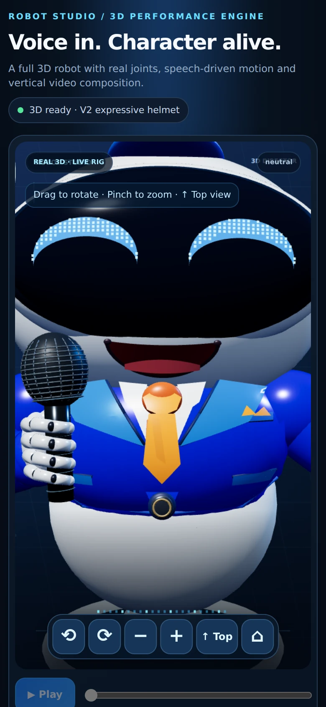
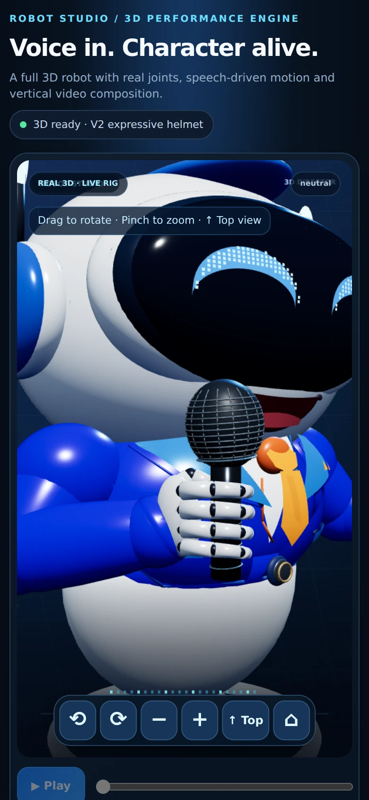
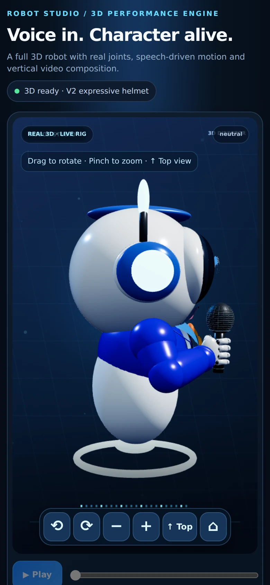

# Microphone grip and next visual priorities — 9 October 2026

## Procedural grip revision

The V14.2 palm used a .220-depth ellipsoid rotated 88 degrees around Z. It reached into the finger/thumbnail volume. V15 replaces that gripping-only branch with a single slimmer metacarpal shell. There is no extra palm liner or knuckle plate on the microphone side.

Four fingers now have three tapered ceramic phalanges each, two graphite hinge seams, nested articulation pivots, staggered curl, and distal segments that turn back toward the microphone. The thumb emerges from the upper rear palm and meets the rear handle surface. The approved presenting-hand source, materials and wrist construction are preserved.

A second visual iteration reduced exposed hinge size and seam gaps after the first screenshots showed overly prominent black beads. Profile screenshots now pull back enough to include the hand.

## Validation

- Python source compilation and JavaScript syntax checks.
- GitHub Actions rebuilds both the `.blend` and `.glb` using Blender.
- The mobile suite runs against the freshly generated GLB before the build commits assets and deploys.
- Chromium uses a 390 × 844 touch viewport with device scale 2. This is mobile emulation, not a physical iPhone or Safari test.
- Checks cover model loading, rig objects, touch orbit, vertical tilt, pinch, zoom controls, top view/reset, audio decoding/playback, gesture planning, Director JSON, and 1080 × 1920 recording with restoration to preview resolution.
- Front, three-quarter and side screenshots are reviewed manually.
- An independent V14.2-versus-V15 GLB comparison confirmed identical vertex positions, UVs, local transforms and triangle connectivity for all 32 presenting-hand meshes (triangle ordering is normalized; exported normals can differ slightly from floating-point accumulation).

The separate automatic browser workflow previously raced the Blender build and read the old GLB against new geometry assertions. Automatic checks are now consolidated into the build workflow. The stand-alone browser workflow remains available for manual checks.

## Next priorities, in order

1. **Mouth depth and speech shapes.** The front smile is still a flat burgundy cutout with a flat tongue. Sculpt a recessed interior and rounded rim; introduce a small set of shape-key visemes driven by aligned phoneme timings. Preserve the existing mouth node contract while extending it. Validate silence, M/B/P closures, vowels and transitions using actual narration.
2. **Garment fit during rotation.** Three-quarter/profile views expose offset collar/lapel/tie panels away from the torso. Reduce and locally fit their surface offsets, give the edges controlled thickness and inspect for intersections during shoulder gestures. Keep the front silhouette and orange tie identity.
3. **Studio lighting and suit roughness.** The blue jacket has strong saturated plastic-like highlights. Use softer broad highlights and a slightly rougher cloth response while retaining glossy white ceramic. Compare neutral, smiling and speaking shots with one consistent light rig.
4. **Performance continuity.** Keep the grip constrained to the microphone while arms move; smooth gesture transitions and use intentional gaze/blink beats. Mouth currently follows energy rather than phonemes, so visual speech accuracy should precede more random idle movement.
5. **Mobile render cost.** The microphone grille contains many separate tube meshes. Merge static grille geometry by material without changing the silhouette; measure frame time and full-HD capture before adding further details.

These items are a review backlog, not claims that the corresponding work has already been implemented.

## Final evidence

Successful build, mobile checks and deployment: [GitHub Actions run](https://github.com/Humberto0o0/robot-studio/actions/runs/37906225697).

Actual browser captures from that run (WebP copies):

